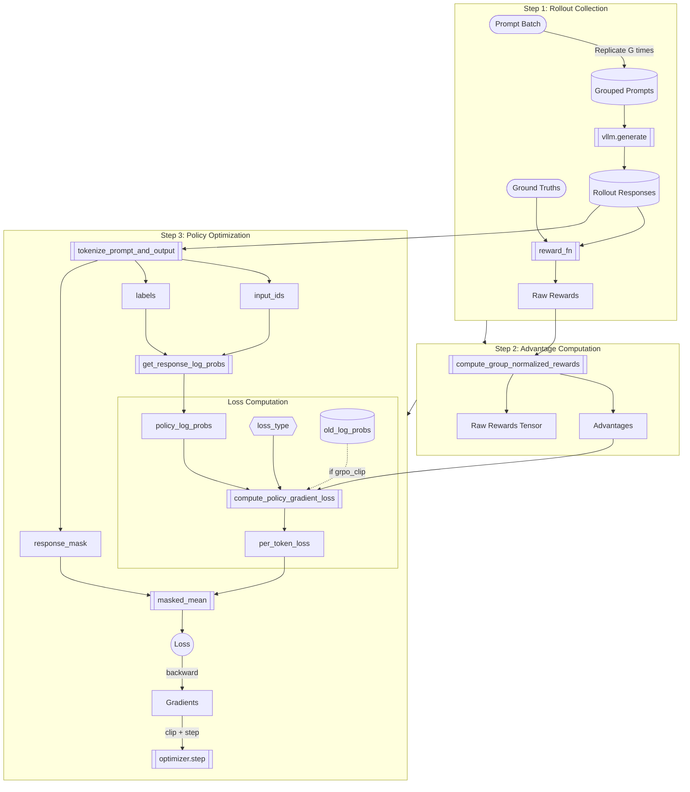

# Group Relative Policy Optimization (GRPO)

Group Relative Policy Optimization (GRPO) is a reinforcement learning algorithm tailored for reasoning tasks (like mathematical problem solving). Instead of training a separate value function (critic) to estimate the baseline for advantage computation—which can be expensive and unstable—GRPO uses the group of outputs generated from the same prompt to estimate a baseline.

By sampling $G$ outputs $\{o_1, o_2, ..., o_G\}$ for a single prompt $q$, we can calculate the advantage of each output relative to the group's performance.

## GRPO Workflow

The following chart illustrates the data flow and key operations in a single GRPO training step.

**Shape Legend:**
- 📦 Rectangle `[ ]` = Data tensors
- 🏟️ Stadium `([ ])` = Input/Output
- 📋 Subroutine `[[ ]]` = Function call
- 💠 Hexagon `{{ }}` = Decision/Switch
- 🔵 Circle `(( ))` = Final result
- 🗄️ Cylinder `[( )]` = Storage/Cache



### Workflow Code Mapping

Each node in the workflow corresponds to specific code:

#### Step 1: Rollout Collection
```python
# q7_run_grpo.py: collect_rollouts()
sampling_params = SamplingParams(n=group_size, ...)
outputs = llm.generate(prompts, sampling_params)

# Score each response
for response, gt in zip(rollouts, ground_truths):
    reward_info = r1_zero_reward_fn(response, gt)
```

#### Step 2: Advantage Computation
```python
# q7_grpo.py: compute_group_normalized_rewards()
grouped_raw = raw_tensor.view(-1, group_size)
group_means = grouped_raw.mean(dim=1, keepdim=True)
if normalize_by_std:
    group_stds = grouped_raw.std(dim=1, keepdim=True, unbiased=True)
    normalized = (grouped_raw - group_means) / (group_stds + eps)
else:
    normalized = grouped_raw - group_means
```

#### Step 3: Policy Optimization
```python
# q7_run_grpo.py: grpo_step() inner loop
toks = tokenize_prompt_and_output(prompts, responses, tokenizer)
log_probs_out = get_response_log_probs(model, toks["input_ids"], toks["labels"])

loss_per_token, meta = compute_policy_gradient_loss(
    policy_log_probs=log_probs_out["log_probs"],
    loss_type=loss_type,  # "no_baseline" | "reinforce_with_baseline" | "grpo_clip"
    advantages=advantages,
    old_log_probs=old_log_probs,  # only for grpo_clip
    cliprange=cliprange,
)

loss = masked_mean(loss_per_token, toks["response_mask"], dim=1).mean()
loss.backward()
optimizer.step()
```

## Core Implementation Components

The implementation is split between the mathematical primitives in `cs336_alignment/q7_grpo.py` and the training loop in `cs336_alignment/q7_run_grpo.py`.

### 1. Group Normalized Rewards
The central feature of GRPO is how advantages are computed. We take a batch of rollouts, group them by their prompt, and normalize the rewards within each group.

**File:** `cs336_alignment/q7_grpo.py`

```python:cs336_alignment/q7_grpo.py
def compute_group_normalized_rewards(...):
    # ...
    # Reshape flat rewards into groups (Batch // G, G)
    grouped_raw = raw_tensor.view(-1, group_size)

    # Compute group statistics
    group_means = grouped_raw.mean(dim=1, keepdim=True)
    
    if normalize_by_std:
        # Standard GRPO: (R - Mean) / Std
        group_stds = grouped_raw.std(dim=1, keepdim=True, unbiased=True)
        normalized = (grouped_raw - group_means) / (group_stds + advantage_eps)
    else:
        # Dr. GRPO variant: R - Mean
        normalized = grouped_raw - group_means
    # ...
```

This acts as a per-prompt baseline. If a prompt is very hard, all rewards might be low, but the best among them will still have a positive advantage after normalization.

### 2. Loss Functions

We support multiple policy gradient objectives via `compute_policy_gradient_loss`.

#### Naive Policy Gradient (REINFORCE)
Used for single-update (on-policy) training.
$$ \mathcal{L} = - A_t \cdot \log \pi_\theta(o_t | q, o_{<t}) $$

```python:cs336_alignment/q7_grpo.py
def compute_naive_policy_gradient_loss(raw_rewards_or_advantages, policy_log_probs):
    return -raw_rewards_or_advantages * policy_log_probs
```

#### GRPO-Clip
Used for multi-update (off-policy) training. Similar to PPO, it limits how much the policy can change by clipping the probability ratio $r_t(\theta) = \frac{\pi_\theta(o_t)}{\pi_{\theta_{old}}(o_t)}$.

$$ \mathcal{L} = - \min(r_t A_t, \text{clip}(r_t, 1-\epsilon, 1+\epsilon)A_t) $$

```python:cs336_alignment/q7_grpo.py
def compute_grpo_clip_loss(advantages, policy_log_probs, old_log_probs, cliprange):
    ratio = torch.exp(policy_log_probs - old_log_probs)
    unclipped_obj = ratio * advantages
    clipped_obj = torch.clamp(ratio, 1.0 - cliprange, 1.0 + cliprange) * advantages
    # maximize objective => minimize -objective
    return -torch.minimum(unclipped_obj, clipped_obj), ...
```

### 3. Masked Aggregation
Language model outputs vary in length. We use `masked_mean` to compute the average loss only over valid response tokens (ignoring prompts and padding).

```python:cs336_alignment/q7_grpo.py
def masked_mean(tensor, mask, dim=None):
    # ...
    masked = tensor * mask.to(tensor.dtype)
    return masked.sum(dim=dim) / mask.sum(dim=dim)
```

## Training Loop

The training loop in `cs336_alignment/q7_run_grpo.py` orchestrates the process.

### Step 1: Rollout Collection
We use `vLLM` to efficiently generate $G$ completions for a batch of prompts.

```python:cs336_alignment/q7_run_grpo.py
# Inside grpo_step
sampling_params = build_sampling_params(group_size=group_size)
rollouts, repeated_gts, reward_infos = collect_rollouts(llm, batch_prompts, batch_gts, sampling_params)
```

### Step 2: Advantage Computation
We immediately calculate the rewards (e.g., matching the ground truth answer) and normalize them using the function described above.

```python:cs336_alignment/q7_run_grpo.py
advantages, raw_rewards, reward_meta = compute_group_normalized_rewards(
    reward_fn=r1_zero_reward_fn,
    # ...
    group_size=group_size,
    normalize_by_std=use_std_normalization,
)
```

### Step 3: Gradient Updates
We iterate over the data (micro-batching to fit in GPU memory).
1. **Forward Pass**: Compute current log probabilities (`get_response_log_probs`).
2. **Loss Computation**: Calculate per-token loss using the advantages.
3. **Masking**: Apply `response_mask` so we don't train on padding.
4. **Backward**: Accumulate gradients and step.

```python:cs336_alignment/q7_run_grpo.py
# Inside training loop
loss_per_token, meta = compute_policy_gradient_loss(
    policy_log_probs=policy_log_probs,
    loss_type=loss_type,
    advantages=adv_slice,
    # ...
)

# Mask to response tokens and average per example
masked_loss = loss_per_token * toks["response_mask"]
per_example_loss = masked_mean(masked_loss, toks["response_mask"], dim=1)
loss = per_example_loss.mean()
```

If `loss_type="grpo_clip"`, we precompute `old_log_probs` before the optimization loop starts to serve as the reference for the ratio calculation.

## Length Normalization: `masked_mean` vs `masked_normalize`

In the standard REINFORCE update, the policy gradient is $\nabla J(\theta) = \mathbb{E}[\sum_t \nabla \log \pi(a_t|s_t) A_t]$. Notably, there is no division by the sequence length $T$.

### Example: Gradient Magnitude Analysis

Consider an example where we have two responses in a batch:
1.  **Response A**: Short (4 tokens). Advantage = 2.0.
2.  **Response B**: Long (7 tokens). Advantage = 2.0.

Since the advantage is constant (2.0), the per-token gradient for each token $t$ is effectively proportional to the scaling factor applied to the sum.

#### `masked_mean` (Average over tokens)
This divides the sum by $T$.
$$ \text{Gradient}_t \propto \frac{\text{Advantage}}{T} $$
*   **Response A (4 tokens)**: Gradient per token $\approx 2.0 / 4 = 0.5$.
*   **Response B (7 tokens)**: Gradient per token $\approx 2.0 / 7 \approx 0.29$.

**Result**: The model receives a **stronger per-token signal** for the short response ($0.5$ vs $0.29$).

#### `masked_normalize` (Sum over tokens, divide by constant)
This divides by a constant $C$ (e.g., `max_len=7`).
$$ \text{Gradient}_t \propto \frac{\text{Advantage}}{C} $$
*   **Response A (4 tokens)**: Gradient per token $\approx 2.0 / 7 \approx 0.29$.
*   **Response B (7 tokens)**: Gradient per token $\approx 2.0 / 7 \approx 0.29$.

**Result**: Every token receives the **same signal** regardless of response length.

### Pros/Cons Analysis

#### `masked_mean`
- **Pros**: It stabilizes training by ensuring the total gradient magnitude per example is roughly $1.0$ (since $T \times \frac{1}{T} = 1$). This prevents extremely long responses (which might just be rambling) from dominating the gradient updates simply because they have more terms in the sum. It is a "safe" default for stability.
- **Cons**: As shown above, it biases learning towards shorter answers at the token level. It effectively penalizes "thinking longer" because the reward signal gets diluted over more tokens.

#### `masked_normalize`
- **Pros**: It is unbiased with respect to length. It ensures that valid reasoning steps in a long Chain-of-Thought are valued just as much as steps in a short answer, which is crucial for reasoning tasks where we want to encourage exploration.
- **Cons**: It increases variance. The total gradient magnitude for Response B ($7 \times 0.29 = 2.0$) is much larger than Response A ($4 \times 0.29 = 1.16$). If the model generates a 1000-token hallucination, the update size could be massive, potentially destabilizing training.

**Conclusion**: `masked_mean` is safer but biased against length; `masked_normalize` is unbiased but higher variance. In reasoning tasks where we *want* to encourage long Chains-of-Thought (like in DeepSeek-R1), `masked_normalize` (or just summing) is often preferred to avoid discouraging the model from "thinking" for longer, provided we can handle the variance (e.g., via clipping).